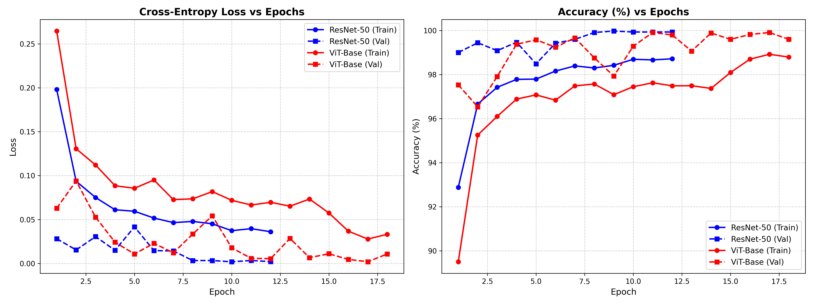
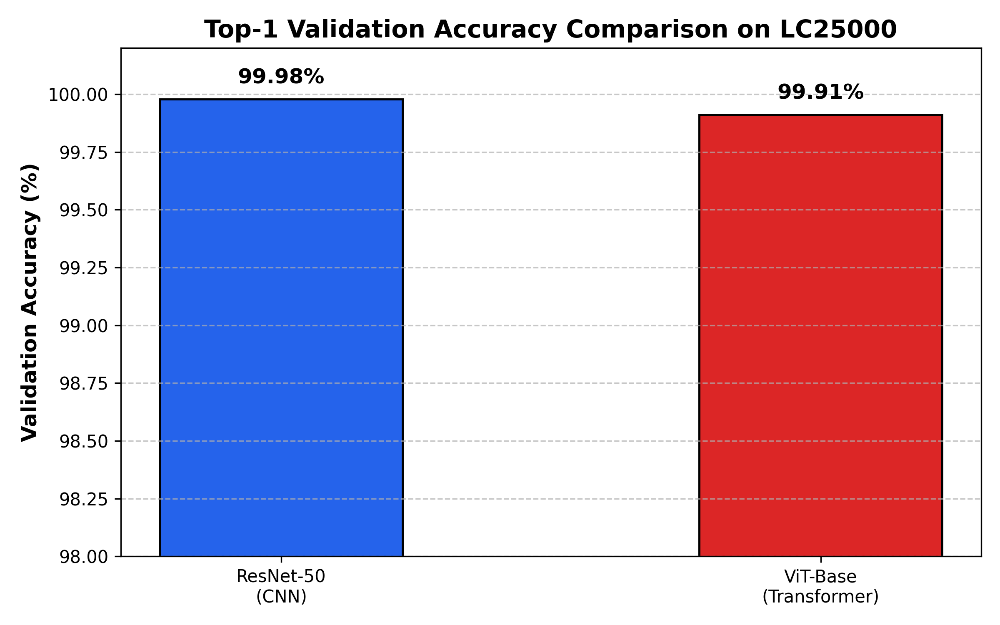

# Lung & Colon Cancer Histopathology Classification

[](https://www.python.org/)
[](https://pytorch.org/)
[](https://www.kaggle.com/datasets/andrewmvd/lung-and-colon-cancer-histopathological-images)
[](LICENSE)

A comparative Deep Learning study for the automated, multi-class diagnosis of lung and colon cancer histopathology images using **Convolutional Neural Networks (ResNet-50)** versus **Self-Attention Vision Transformers (ViT-Base)** on the benchmark **LC25000** dataset.

---

## 📌 Project Overview

Histopathological evaluation of tissue biopsies remains the gold standard for cancer diagnosis. This project builds and compares clinical-grade computer vision models for automated classification across **5 distinct diagnostic classes**:

1. `colon_aca`: Colon Adenocarcinoma (Malignant)
2. `colon_n`: Benign Colon Tissue
3. `lung_aca`: Lung Adenocarcinoma (Malignant)
4. `lung_n`: Benign Lung Tissue
5. `lung_scc`: Lung Squamous Cell Carcinoma (Malignant)

---

## 🧠 Architectures Compared

| Architecture | Paradigm | Total Parameters | Key Characteristic |
| :--- | :--- | :---: | :--- |
| **ResNet-50** | Convolutional Neural Network (CNN) | **23.52 M** | Deep residual bottlenecks with skip connections capturing localized cellular and gland textures. |
| **ViT-Base (`vit_b_16`)** | Self-Attention Transformer | **85.80 M** | $16 \times 16$ patch projection with Multi-Head Self-Attention (MHSA) capturing global spatial tissue dependencies. |

---

## 📊 Dataset & Preprocessing

- **Dataset**: [LC25000 (Lung and Colon Cancer Histopathological Images)](https://www.kaggle.com/datasets/andrewmvd/lung-and-colon-cancer-histopathological-images).
- **Scale**: 25,000 total images evenly balanced (5,000 images per class).
- **Split**: 90% Training (22,500 images) / 10% Validation (2,500 images).
- **Preprocessing Pipeline**:
  - Resized to $224 \times 224$ pixels.
  - Data Augmentation: Random horizontal flip, random rotation, color jitter (brightness/contrast adjustment).
  - ImageNet normalization ($\mu = [0.485, 0.456, 0.406]$, $\sigma = [0.229, 0.224, 0.225]$).

---

## 🔬 Experimental Results & Benchmark Comparison

Both architectures were trained end-to-end using Cross-Entropy Loss with AdamW optimization and dynamic learning rate scheduling.

### 1. Performance Summary

| Architecture | Model Type | Parameters | Best Val Accuracy | Best Val Loss | Convergence Epoch |
| :--- | :--- | :---: | :---: | :---: | :---: |
| **ResNet-50** | Residual CNN | 23.52 M | **99.98%** | **0.0018** | Epoch 10 |
| **ViT-Base** | Vision Transformer | 85.80 M | **99.91%** | **0.0019** | Epoch 17 |

---

### 2. Training & Validation Curves
Comparison of loss convergence and top-1 accuracy progression across epochs:



---

### 3. Model Accuracy Comparison
Top-1 classification accuracy on the held-out validation set:



---

## 📁 Repository Structure

```
Cancer_Histopathology_Classification_ViT_ResNet/
├── cancer_classification_vit_resnet.ipynb  # End-to-end notebook (Pipeline, ResNet-50 & ViT-Base)
├── README.md                               # Project documentation & benchmark analysis
├── LICENSE                                 # MIT Open-Source License
├── .gitignore                              # Standard PyTorch ignore rules
└── results/                                # Comparison charts and performance plots
    ├── training_comparison_curves.png
    └── model_accuracy_comparison.png
```

---

## 🚀 Getting Started

### Prerequisites
Install PyTorch, Torchvision, and required scientific libraries:
```bash
pip install torch torchvision timm numpy pandas matplotlib scikit-learn pillow
```

### Running the Notebook
Open `cancer_classification_vit_resnet.ipynb` in Jupyter Notebook or Google Colab:
```bash
jupyter notebook cancer_classification_vit_resnet.ipynb
```
Follow the step-by-step cells to:
1. Load and augment the LC25000 dataset.
2. Instantiate ResNet-50 and Vision Transformer backbones.
3. Train or load model checkpoints.
4. Run comparative evaluation and plot performance curves.
